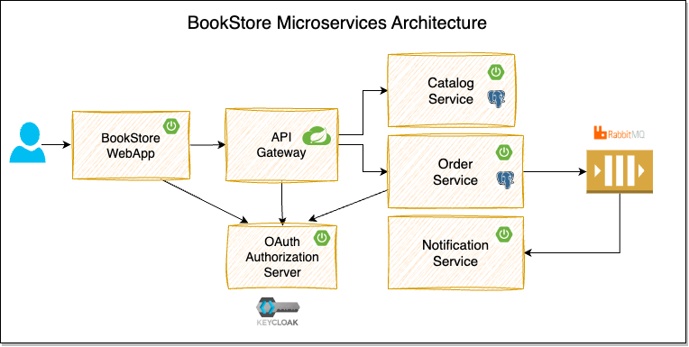

# Bookstore App

A micro-services based web application.

## Modules
### Catalogue Service
- service which handles the books catalogue
- apis : get methods only ( get all products, get product by id )

### Order Service
- order creation, getting order-details & send order-status events to RBMQ.
- apis : post (create order), get(order-details, order-summary)

### Notification Service
- listens to RBMQ for order-status events.
- notifies user via email.
